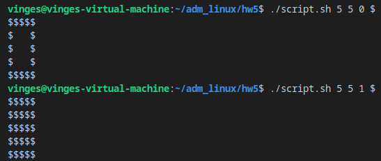
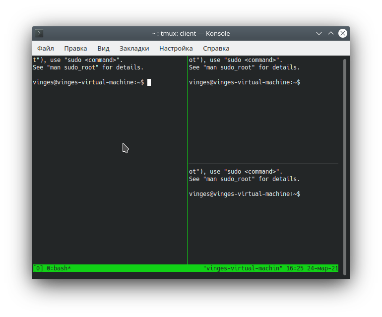

# Вопросы
1) Как отобразить 4 последних выполненных команды?  
    ```bash
    history 4
    ```  
2) Перевести задание в фоновый режим в bash можно командой  
    ```bash
    bg pid
    ```
3) Какая комбинация клавиш переключит вас на 4-ю виртуальную консоль?  
    `Ctrl+Alt+F4`
4) Какая переменная среды содержит путь к домашнему каталогу?
    ```bash
    $HOME
    ```
5) Установить в bash переменную MYVAR в качестве системной можно командой?
    ```bash
    export MYVAR
    ```
6) Какие комбинации клавиш позволят выделить несколько файлов в Midnight Commander?  
`Ctrl+T`
7) Что выведет на экран этот сценарий?
    ```bash
    #!/bin/bash
    VAR=`echo 'test'`
    VAR2=`echo '$VAR'`
    echo $VAR2
    ```
    Вывод: `$VAR`

8) Что выведет на экран это сценарий?
    ```bash
    #!/bin/bash
    cd /etc
    VAR="$PWD"
    if [ -n "$VAR" ]; then
    echo "$VAR"
    else
    echo '$VAR'
    fi 
    ``` 
    Вывод: `/etc`  
9) Что выведет на экран этот сценарий?
    ```bash
    #!/bin/bash
    A=1
    B=2
    if [ $A -eq $B  ]; then
    echo '$A'
    else
    echo "$B"
    fi 
    ```
    Вывод: `2`
# Задачи
## 1) script.sh  
  
## 2) tmux
1) Активация мыши: 
    ```bash
    echo "set -g mouse on" >> ~/.tmux.conf
    ```
2) Запуск:
    ```bash
    tmux
    ```
    или
    ```bash
    tmux new -s <session_id>
    ```
3) Создание новых pane:  
    `CTRL+B c`
4) Split pane: 
    * `CTRL+B %` - вертикальное деление 
    * `CTRL+B "` - горизонтальное деление
5) Zoom:  
    `CTRL+B z`
6) Закрытие pane:   
    `CTRL+B x`
7) Detach:  
    `CTRL+B d`.
8) Attach: 
    ```bash
    tmux attach-session -t <session_id>
    ```
    