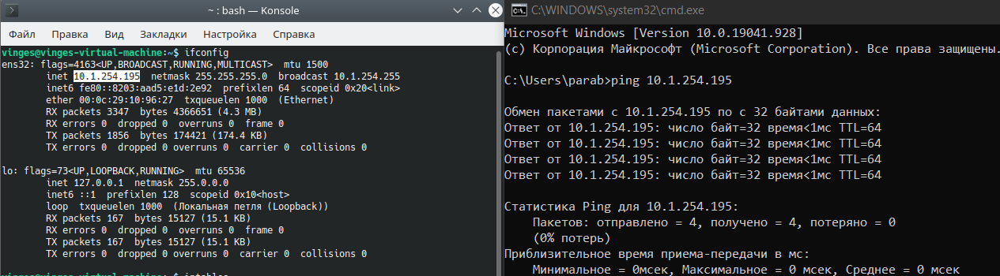
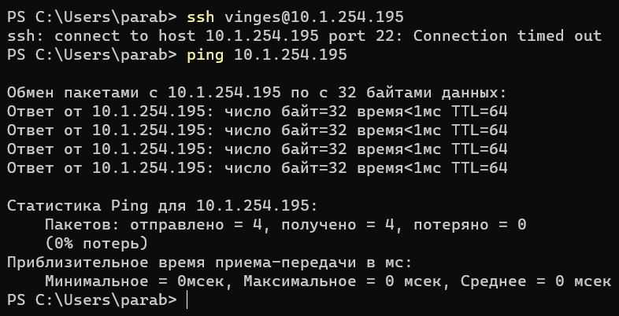

# Теория
## 1) какие базовые цепочки и таблицы существуют в iptables и для чего служат?
* цепочки:
   * PREROUTING — пакеты ДО маршрутизации
   * INPUT — пакеты, предназначенные текущему хосту
   * FORWARD — транзитные пакеты
   * OUTPUT — пакеты от текущего хоста
   * POSTROUTING — все исходящие пакеты 
 * таблицы:
   * MANGLE — классификация и маркировка пакетов и соединений, модификация заголовков
   * NAT — преобразование сетевых адресов и портов
   * FILTER — фильтрация трафика
   * SECURITY — изменение маркировок безопасности
   * RAW — действия с пакетами до обработки conntrack
   * RAWPOST — подмена исходного трафика без использования информации о соединении
## 2) опишите процесс обработки пакета который предназначен данной системе
Пакет пройдёт по следующему пути:  
1) PREROUTING
2) INPUT
3) Локальный процесс, которому назначался пакет
4) OUTPUT
5) POSTROUTING
## 3) что такое conntrack и для чего используется?
Conntrack – компонент, позволяющий ядру отслеживать все логические сетевые соединения или потоки, тем самым идентифицировать все пакеты, которые составляют каждый поток, чтобы их можно было последовательно обрабатывать вместе.
## 4) какими командами создать/удалить цепочку? создать/удалить правило? создать правило до определенного правила в цепочке?
* Создать цепочку:  
`iptables -N CHAINNEW`
* Удалить цепочку:  
`iptables -X CHAINNEW`
* Создать правило:  
`iptables -A CHAIN -s ADDRESS -j ACTION`
* Удалить правило:  
`iptables -D CHAIN`
* Создать правило до определённого правила в цепочке:  
`iptables -I CHAIN N -s ADDRESS -j ACTION`
# Практика
## 1) настроить правила которые разрешают доступ на этот сервер с определенной подсети или хоста в которой находитесь вы как клиент, продемонстрировать что работает icmp
```bash
sudo iptables -I INPUT -s 10.1.254.0/24 -j ACCEPT
```

## 2) затем закрыть доступ из этой подсети по icmp, оставив доступ по ssh, продемонстрировать что хост по ssh доступен а icmp нет
```bash
sudo iptables -I INPUT -s 10.1.254.0/24 -j DROP
sudo iptables -I INPUT -s 10.1.254.0/24 -p tcp --dport 22 -j ACCEPT
```

## 3) запретить только ssh, но icmp работает, сервер пигается
```bash
sudo iptables -I INPUT -s 10.1.254.0/24 -p tcp --dport 22 -j DROP
```
