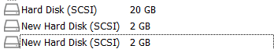
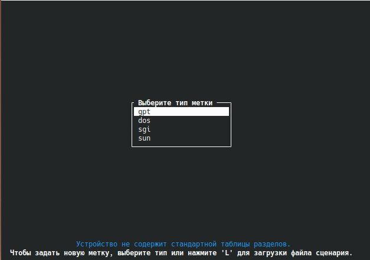
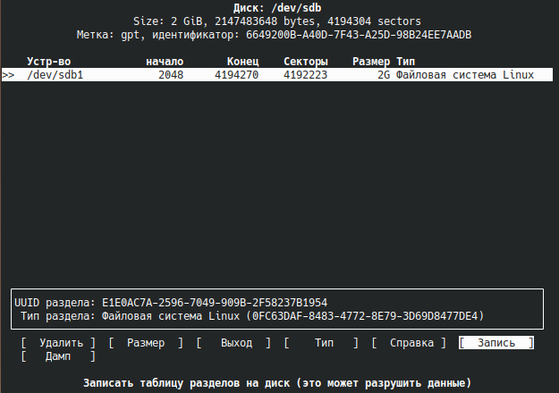
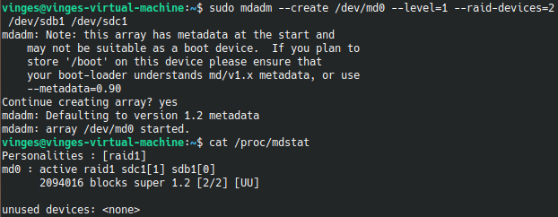
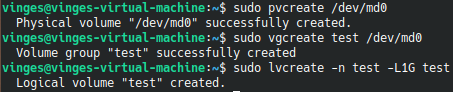
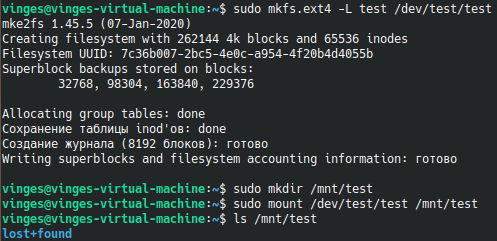
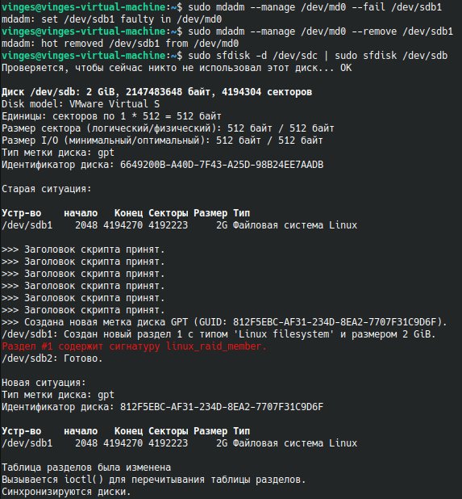
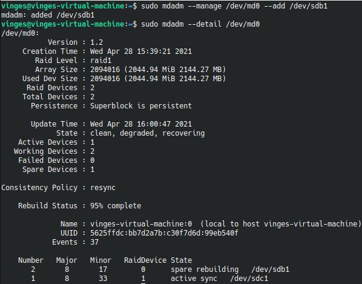
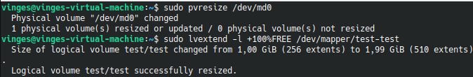
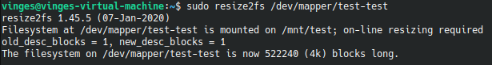

# Теория:
## 1. Что такое RAID для каких целей он используется?
 RAID - дисковый массив из нескольких дисков. Используется для повышения надежности и/или повышения скорости работы дисковых устройств.
## 2. Объясните различия между Raid0, Raid1 и Raid5? Плюсы, минусы, принцип.
 * RAID0 - массив дисков с чередованием данных. Обладает высокой скоростью записи и чтения, однако имеет самую низкую надежность хранения, поскольку выход любого диска приводит к потере всего массива.
 * RAID1 - зеркалированный массив, в котором запись идет на все диски сразу. Обладает наибольшей степенью надежности и высокой скоростью чтения, однако наименее эффективно использует дисковое пространство.
 * RAID5 - массив дисков с поблочным чередованием. Позволяет проводить параллельную запись, обладает повышенной скоростью чтения, высокой эффективностью использования дискового пространства и допускает выход из строя одного из дисков. Однако в случае потери одного диска повышается нагрузка на остальные из-за процесса восстановления RAID.
## 3. Что такое Raid 10
 * RAID10 - массив дисков с зеркалированием и чередованием (массив RAID0 из нескольких RAID1).
## 4. аппаратный, софтфовый и fake raid что это?
 * Аппаратный - отдельный контроллер с собственным процессором и кэшом, использующимися для выполнения дисковых операций.
 * Fake raid - микрочип на материнской плате, частично выполняющий функционал аппаратного рейд-контроллера
 * Софтовый - RAID, созданный средствами операционной системы и программного обеспечения
## 5. Что такое LVM? Для чего применяется?
 LVM - подсистема ОС Linux, позволяющая использовать разные области одного диска и/или области с разных дисков в качестве одного логического тома.
## 6. Опишите структуру LVM
 * Физический том - устройство, представимое в ОС как один диск
 * Группа физических томов
 * Логический том, доступный программам


# Практика:

## 1. Добавить в виртуальном сервере два hdd



## 2. Собрать на них raid1 массив

```bash
sudo cfdisk /dev/sdb
sudo cfdisk /dev/sdc
```





```bash
sudo mdadm --create /dev/md0 --level=1 --raid-devices=2 /dev/sdb1 /dev/sdc1
```



## 3. поверх raid массива развернуть lvm
```bash
sudo pvcreate /dev/md0
sudo vgcreate test /dev/md0
sudo lvcreate -n test -L1G test
```



## 4. создать файловую систему в lvm разделах и примонтировать в систему
```bash
sudo mkfs.ext4 -L test /dev/test/test
sudo mkdir /mnt/test
sudo mount /dev/test/test /mnt/test
```



## 5. продемонстрировать умение замены жесткого диска
```bash
sudo mdadm --manage /dev/md0 --fail /dev/sdb1
sudo mdadm --manage /dev/md0 --remove /dev/sdb1
sudo sfdisk -d /dev/sdc | sudo sfdisk /dev/sdb
```



```bash
sudo mdadm --manage /dev/md0 --add /dev/sdb1
sudo mdadm --detail /dev/md0
```



## 6. расширить размер раздела за счет неиспользуемого пространтсва в raid массиве
```bash
sudo pvresize /dev/md0
sudo lvextend -l +100%FREE /dev/mapper/test-test
sudo resize2fs /dev/mapper/test-test
```



